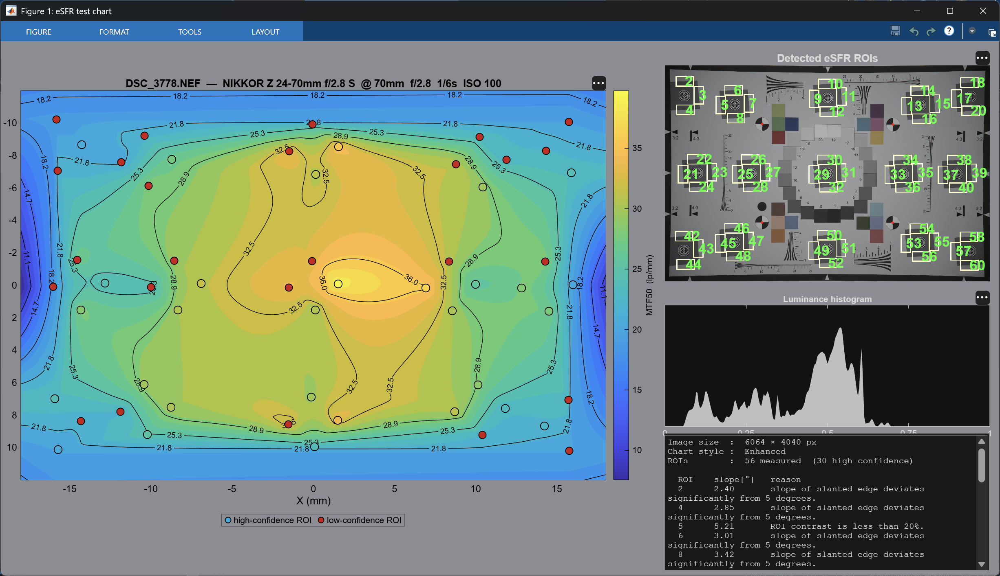

# eSFR Nikon GUI

MATLAB GUI for measuring and visualising MTF sharpness across the full frame of Nikon 24.5 MP cameras (IMX410 / IMX820 sensor, e.g. Z6 III, Z5 II).



## What it does

1. Opens a Nikon NEF raw file
2. Decodes the raw Bayer data to demosaiced sRGB
3. Detects the eSFR (enhanced Spatial Frequency Response) chart automatically
4. Measures MTF at every slanted-edge ROI across the frame
5. Interpolates the results onto a regular grid and displays a colour-coded contour map showing how sharpness varies from centre to corners

## GUI layout

| Panel | Content |
|---|---|
| Left (large) | MTF contour field map with ROI scatter overlay |
| Top right | Detected eSFR chart with ROI outlines |
| Middle right | Luminance histogram of the RAW file |
| Bottom right | Processing log (image size, chart style, ROI count, summary) |

## Requirements

| Requirement | Version |
|---|---|
| MATLAB | R2021a or later |
| Image Processing Toolbox | any recent version |
| Camera Support Package for Nikon | any recent version |

## Quick start

```matlab
% Option 1 — file picker
eSFR_Nikon_GUI

% Option 2 — hardcode the path
% Edit RAW_FILE in the CONFIG section at the top of the script, then run.
```

## Configuration

At the top of `eSFR_Nikon_GUI.m`:

```matlab
RAW_FILE = '';          % '' → file picker dialog; or set a full path
PERCENT  = 50;          % MTF percentage: 50 → MTF50, 30 → MTF30, …
CHANNEL  = 'luminance'; % 'red' | 'green' | 'blue' | 'luminance'
```

## Sensor parameters

The script is fixed to the Nikon 24.5 MP full-frame sensor:

| Parameter | Value |
|---|---|
| Sensor size | 35.9 × 23.9 mm |
| Resolution | 6048 × 4024 px |
| Pixel pitch | 5.94 µm |
| Pixel Nyquist | ≈ 84.2 lp/mm |

To adapt for a different sensor, update `PIXEL_PITCH_UM` and the header comment.

## Output

- **Contour map** — MTF50 (lp/mm) across the sensor plane, with filled colour bands and labelled isolines
- **ROI scatter** — each measurement point coloured by its MTF value; low-confidence ROIs shown in red with hover tooltips explaining the reason
- **Legend** — appears automatically when any low-confidence ROIs are present

## License

MIT
